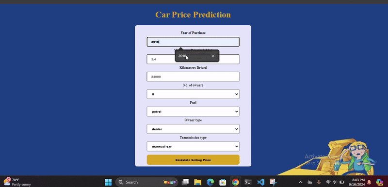

# car_price_prediction


This project is designed to predict the selling price of a used car based on a dataset of several key features. The model analyzes various attributes of cars, such as their age, fuel type, kilometers driven, and more, to give an accurate prediction of the selling price. The project is useful for anyone looking to sell or buy a used car, helping to set the right price based on car specifications.

The project is developed using Python and includes different machine learning models, preprocessing techniques, and evaluation metrics to ensure high performance.


## Features
Below is the features are highly affected by the selection of the correct  selling price of the mobile.

- Car_Name : 	The name or model of the car. Different car brands and models may have varying resale values due to factors like reliability, popularity, and demand.
- Year :	The year in which the car was purchased. Older cars tend to depreciate in value, so the age of the car is a critical factor.
- Selling_Price :	The price at which the car is being sold. This is the target variable in our dataset, which the model will predict.
- Present_Price :	The price of the car when it was new (ex-showroom price). Helps compare the depreciation of the car over time.
- Kms_Driven :	The total distance the car has been driven (in kilometers). More kilometers usually mean more wear-and-tear, reducing the car's value.
- Fuel_Type :	The type of fuel the car uses, such as Petrol, Diesel, or CNG. Each type has different impacts on a car’s resale value based on fuel economy and maintenance costs.
- Seller_Type :	This indicates whether the seller is an individual or a dealer. Dealers may offer warranties and services that individual sellers cannot, often leading to different price points.
- Transmission :	The type of transmission, i.e., Manual or Automatic. Automatic cars tend to be priced higher due to their convenience, but they may also cost more to maintain.
Owner	The number of previous owners. Cars with more owners tend to have lower resale values due to concerns about wear-and-tear or the way the car was maintained.


## Installation
```bash
  Pip install requrement.txt
```
```bash
astroid==2.4.2
certifi==2020.12.5
chardet==4.0.0
click==7.1.2
colorama==0.4.4
cycler==0.10.0
Flask==1.1.2
gunicorn==20.0.4
idna==2.10
isort==5.6.4
itsdangerous==1.1.0
Jinja2==2.11.2
joblib==1.0.0
jsonify==0.5
kiwisolver==1.3.1
lazy-object-proxy==1.4.3
MarkupSafe==1.1.1
matplotlib==3.3.3
mccabe==0.6.1
numpy==1.19.3
pandas==1.1.5
Pillow==8.0.1
pylint==2.6.0
pyparsing==2.4.7
python-dateutil==2.8.1
pytz==2020.4
requests==2.25.1
scikit-learn==0.23.2
scipy==1.5.4
seaborn==0.11.0
six==1.15.0
sklearn==0.0
threadpoolctl==2.1.0
toml==0.10.2
urllib3==1.26.2
Werkzeug==1.0.1
wincertstore==0.2
wrapt==1.12.1
```
## Deployment

To deploy this project on [render](https://dashboard.render.com/)

```bash
  npm run gunicorn app:app
```


## Demo

Below is the domo for created application




## Live demo
Below is the link for live demo

[https://car-price-prediction-vhnn.onrender.com/](https://car-price-prediction-vhnn.onrender.com/)
## Learning Objective
The following points were the objective of the project . If you are looking for all the following points in this repo then i have not covered all in this repo. I'm working on blog about this mini project and I'll update the link of blog about all the points in details later . (The main intention was to create an end-to-end ML project.)

- Data gathering
- Descriptive Analysis
- Data Visualizations
- Data Preprocessing
- Data Modelling
- Model Evaluation
- Model Deployment
## Technical Aspect
- Using PowerBI dekstop create the report.
- Training a machine learning model using scikit-learn.
- Building and hosting a Flask web app on Render.
- A user has to put details like ram, battry power, Pixel resolution Height etc .
- Once it get all the fields information , the prediction is displayed on a new page .
## Usage/Examples

```javascript
app=Flask(__name__)

@app.route('/')
def page():
    return render_template('index.html')

if __name__=='__main__':
    app.run(debug=True)
```


## Dataset
Now we can download the dataset on Kaggle and make analysis for it. Kaggle is the one of the largest website have to provide the datasets on verious domain.
In the more information about the Kaggle plese [Click Here](https://www.kaggle.com/)

## Acknowledgements

 - [Awesome HTML Templates](templates/index.html)
 - [Awesome Flask file](app.py)
 - [Project Details]([https://github.com/Ganeshdhanawade/Mobile-price-analysis/blob/main/Mobile%20Price%20Classification_detailed.docx](https://github.com/Ganeshdhanawade/Car_price_prediction.git))


## Environment Variables

To run this project, you will need to add the following environment variables to your .env file

`API_KEY`

`ANOTHER_API_KEY`


## Installation

Install my-project with npm

```bash
  npm install my-project
  cd my-project
```
    

# Hi, I'm Ganesh! 👋


## 🚀 About Me
I am Completed post graduation in statistics with verious takenincal skills and 2+ year of experiance in data science domain. This project i create on self learning.


## Feedback

If you have any feedback, please reach out to us at dhanawadeganesh386@gmail.com


## 🔗 Links
[](https://github.com/Ganeshdhanawade/Data-Science-Portfolio)
[](https://www.linkedin.com/in/ganesh-dhanawade-47653b201/)


**
